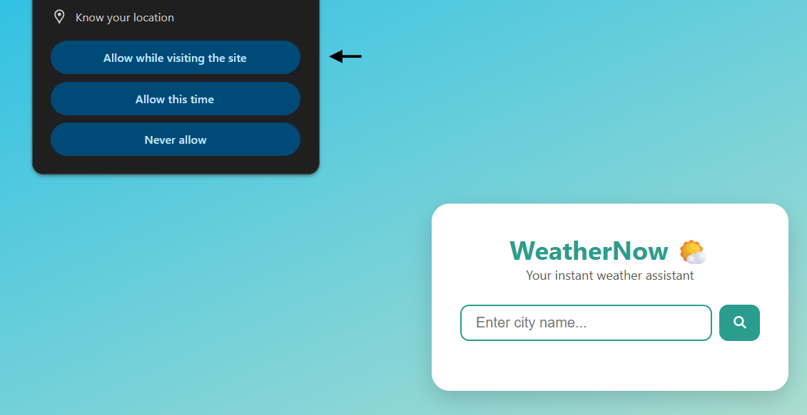
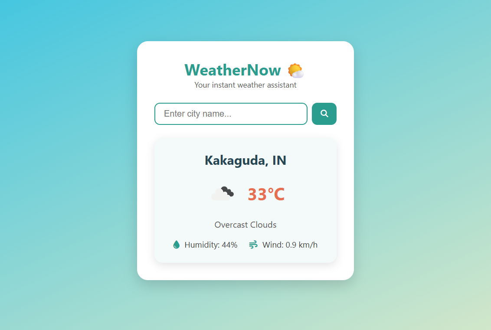
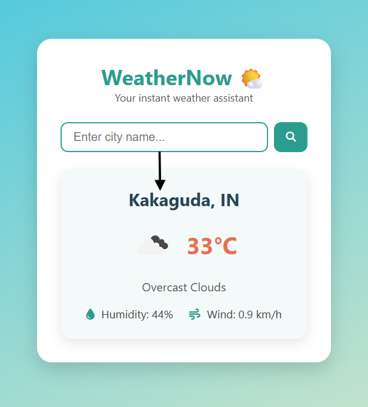

# Weather App

> A modern, responsive weather application that provides real-time weather updates using the OpenWeatherMap API.  
> Users can search for weather information by city or allow the app to detect their current location for instant weather details.

---

## Table of Contents

- [About](#about)  
- [Features](#features)  
- [Demo](#demo)  
- [Technologies Used](#technologies-used)  
- [Project Structure](#project-structure)  
 

---

## About

This Weather App is built with vanilla JavaScript, HTML, and CSS. It fetches real-time weather data from the OpenWeatherMap API and displays it in a clean and user-friendly interface. The app supports manual city search and automatic geolocation detection to deliver accurate weather details instantly.

---

## Features

- **Search by City:** Input a city name to get current weather data.  
- **Auto-detect Location:** Uses browser geolocation to fetch weather for user's current location.  
- **Real-time Data:** Displays temperature, weather description, humidity, wind speed, and weather icon.  
- **Loading Indicator:** Visual feedback during API calls.  
- **Robust Error Handling:** User-friendly messages for invalid city names, denied location access, or network issues.  
- **Responsive Design:** Works seamlessly across devices of all sizes.  

---

## Demo

Check out the live demo here:  
🔗 [Weather App Live](https://udithshankarg.github.io/weather-app/)

### Screenshots

| Location Permission Prompt       | Main UI View                   | Search Input                |
|---------------------------------|-------------------------------|---------------------------------|
|      |                |   |

---

## Technologies Used

- **JavaScript (ES6+)**  
- **HTML5**  
- **CSS3**  
- **OpenWeatherMap API**  

---

## Project Structure

```plaintext
app/
├── .gitignore            # Files and folders to ignore by git
├── config.js             # Contains API key constant
├── index.html            # Main HTML file (UI structure)
├── style.css             # CSS styles for design and layout
├── app.js                # JavaScript logic for weather fetching and UI update
├── package.json          # Project metadata and npm dependencies (if any)
└── README.md             # Project documentation (this file)
